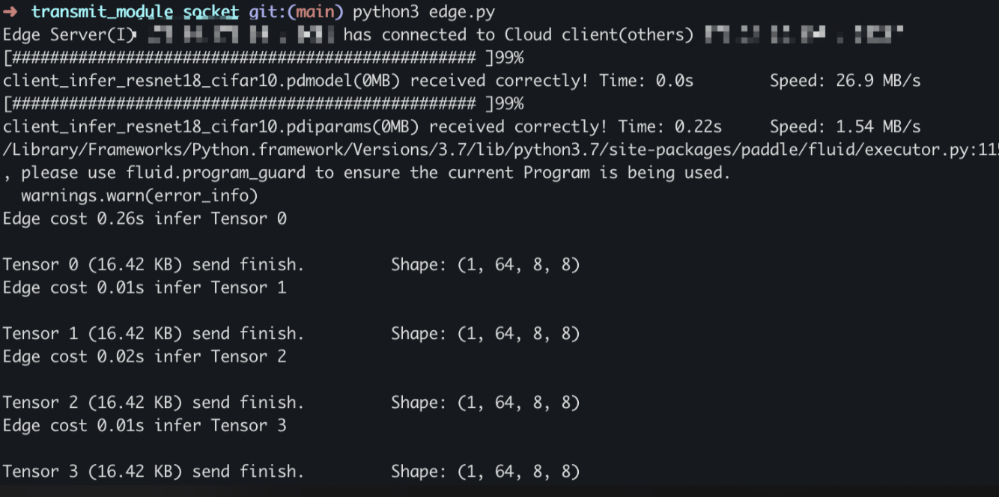

# transmit_module_socket
**基于Socket的通信模块**
## 文件说明

- `client.py`：客户端接收文件，对于云接收tensor，对于端接收分割模型；
- `server.py`：服务端发送文件，对于云发送分割模型，对于端发送tensor；
- `cloud.py`：启动云的发送和接收线程；
- `edge.py`：启动端的发送和接收线程；
- `core.py`：常量定义，包括host、port、buffersize等内容
- data：数据存放文件夹（在示例中：模型暂存为.pdparams文件，tensor暂存为.txt文件）
    - send：发送文件夹
        - model：云要发送的切割模型
        - tensor：端要发送的tensor特征
    - receive：接收文件夹
        - model：端接收到的切割模型
        - tensor：云接收到的tensor特征

## 启动方式

```bash
# 云进程
$ python3 cloud.py --cloud_host "xxx.xxx.xxx.xxx" --edge_host "xxx.xxx.xxx.xxx" --cloud_port n --edge_port n 

# 端进程
$ python3 edge.py --cloud_host "xxx.xxx.xxx.xxx" --edge_host "xxx.xxx.xxx.xxx" --cloud_port n --edge_port n
```

Tips
1. host为必须项，port为可选项，默认为：`8080（CLOUD_SENDTO_EDGE）`和`8081（EDGE_SENDTO_CLOUD）`。
2. 接收和发送文件说明：模型包括`.pdmodel`模型架构和`.pdiparams`模型参数两个文件，特征为`.pdtensor`文件。

## 运行示例（云ip通常为固定值，故仅设置端ip）：

### 云服务器


### 端设备


## 通信传输模块

### 流程图及解释


该项目涉及通信相关的内容：

1. 云下发切割后的部分模型给端设备，包括模型骨架`*.pdmodel`和模型参数`*.pdiparams`两个文件；
2. 端根据部分模型进行计算，得到中间特征`*.pdtensor`；
3. 端返回得到的中间tensor给云；
4. 云根据中间tensor进行剩余部分的计算，得到最终结果。

### 线程说明

通信过程包括4个线程，其中云和端各两个线程：

云：

1. 发送模型线程，该线程轮询检测`data/send/model`中是否有新产生的模型，若有则发送至端；
2. 接收特征线程，该线程连接至端发送端口，接收中间特征并保存至`data/receive/tensor`；

端：

1. 发送特征线程，该线程轮询检测`data/send/tensor`中是否有新生成的tensor，若有则发送至云；
2. 接收模型线程，该线程连接至云发送端口，接收切割模型并保存至`data/receive/model`；
